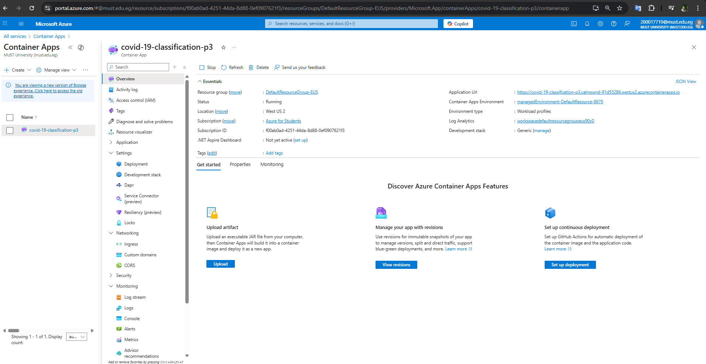
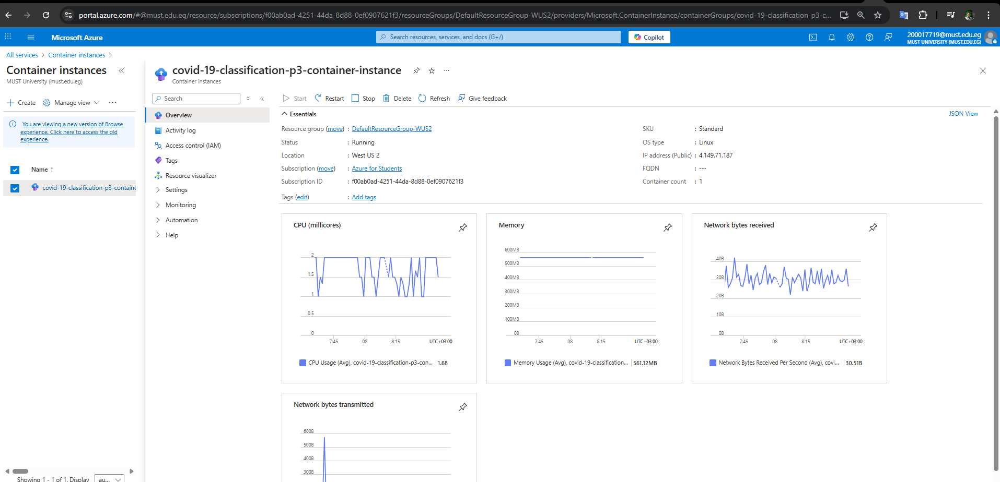
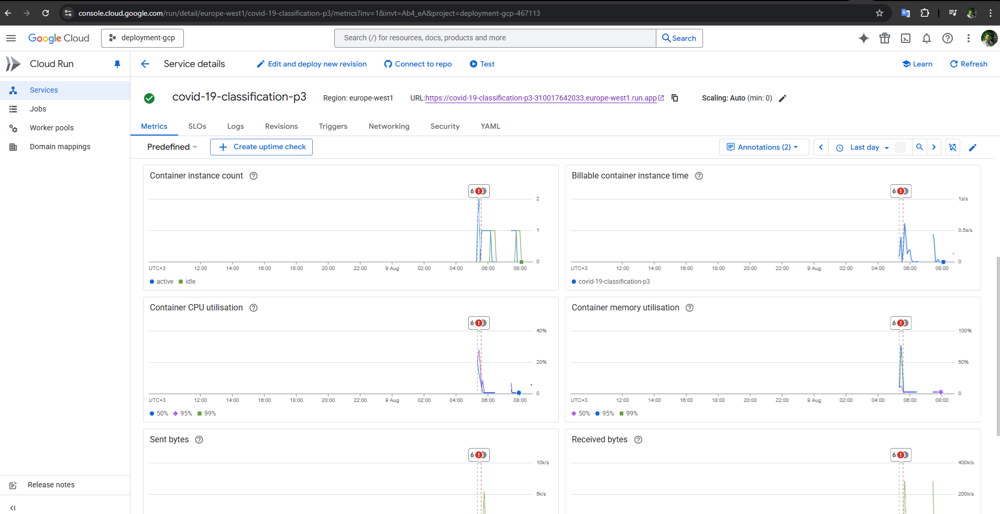

## COVID‑19 Reinfection Predictor & Research Chatbot

End‑to‑end system that predicts the risk of COVID‑19 reinfection from structured patient data and explains the decision using Retrieval‑Augmented Generation (RAG) over peer‑reviewed medical literature. It ships with a FastAPI backend, a Next.js UI, a Streamlit dashboard, a reproducible RAG pipeline, and Docker packaging for deployment to local and cloud environments.

-------------------------------------------------------------------------------------------------------------------------------------------------------------------------------


## Table of Contents

  - [Overview](#overview)
  - [Project Structure](#project-structure)
  - [Features](#features)
  - [Setup](#setup)
  - [Backend API (FastAPI) Usage](#backend-api-fastapi-usage)
  - [Run with Next.js Application](#run-with-nextjs-application)
  - [Run with Streamlit Application](#run-with-streamlit-application)
  - [RAG Module](#rag-module)
  - [Dockerization](#dockerization)
  - [Cloud Deployment GCP And Azure](#cloud-deployment-gcp-and-azure)

-------------------------------------------------------------------------------------------------------------------------------------------------------------------------------


## Overview

This project predicts whether a patient is at risk of COVID‑19 reinfection based on demographics, vaccination history, clinical data, and prior infection timelines. The API augments its prediction with a literature‑grounded explanation produced by a RAG pipeline that retrieves relevant PubMed abstracts from a FAISS index and summarizes them with Azure OpenAI ( GPT-4 ).

Key model assets:
- `covid_predictor_api/model/best_model.pkl` – trained ML Model classifier
- `covid_predictor_api/model/scaler.pkl` – feature scaler used at inference
- `covid_predictor_api/model/encoders.pkl` – label encoders for categorical features

RAG assets:
- `RagModule/data/pubmed_abstracts.csv` – fetched abstracts
- `RagModule/vectorstore/faiss_pubmed/` – FAISS index built from the abstracts

-------------------------------------------------------------------------------------------------------------------------------------------------------------------------------


## Project Structure

```
covid-19-classification/
├─ covid_predictor_api/
│  ├─ main.py                    # FastAPI app: /predict, /chat, /health
│  └─ app/
│     ├─ model_interface.py      # Loads model and runs inference
│     ├─ preprocessing.py        # Feature engineering + scaling/encoding
│     └─ schemas.py              # Pydantic request/response models
│
├─ RagModule/
│  ├─ scripts/
│  │  ├─ fetch_pubmed.py         # Fetch PubMed abstracts
│  │  ├─ build_vectorstore.py    # Build FAISS index
│  │  └─ rag_pipeline.py         # RAG generation (explanations & chat)
│  ├─ data/                      # pubmed_abstracts.csv, qna_history.json
│  ├─ tests/                     # test_rag_pipeline.py, test_retrieval.py
│  └─ vectorstore/faiss_pubmed/  # Saved FAISS index
│
├─ frontend_nextjs/              # Next.js Frontend App (React 19 & Next.js 15) Dashboard + RAG chatbot
├─ frontend_streamlit/           # Streamlit Frontend App Dashboard + RAG chatbot
├─ models/                       # Model snapshot(s)
├─ data/                         # Datasets (processed/splits)
├─ Dockerfile                    # Multi‑stage build (Next.js + FastAPI)
├─ pyproject.toml                # Project deps (pip/uv compatible)
├─ requirements.txt              # Alternative dependency list
└─ uv.lock                       # uv lockfile
```

-------------------------------------------------------------------------------------------------------------------------------------------------------------------------------

## Features

- Reproducible data and model pipeline artifacts (encoders, scaler, trained model)
- Real‑time reinfection prediction API (FastAPI)
- Evidence‑backed explanations via RAG using FAISS + sentence‑transformers +  OpenAI ( GPT-4 )
- Two frontends: modern Next.js app and Streamlit dashboard (with a research chatbot)
- Ready‑to‑run Docker image and scripts for cloud targets (/GCP)

-------------------------------------------------------------------------------------------------------------------------------------------------------------------------------
## Setup

### Prerequisites:
- Python 3.13+

### Clone the Repository

   ```bash
   git clone https://github.com/Abdelrahman-Elshahed/Covid-19-Classification.git
   ```
### Create and activate a virtual environment:
#### Option A – using pip:
 ```powershell
python -m venv .venv
.venv\Scripts\Activate
pip install -r requirements.txt
```

#### Option B – using uv (fast Python package manager):

```powershell
uv venv
.venv\Scripts\Activate
uv pip install -r requirements.txt
```
### Configure Environment Variables


  1- Copy the `.env.example` file to `.env`:
  ```bash
cp .env.example .env
```

  2- Open the `.env` file and fill in your own values:
  
```bash
AZURE_ENDPOINT=
AZURE_API_KEY=
AZURE_API_VERSION=2024-12-01-preview
DEPLOYMENT_NAME=gpt-4
```

------------------------------------------------------------------------------------------------------------------------
## Backend API (FastAPI) Usage

Base URL (local): `http://127.0.0.1:8000`

### Endpoints:
- GET `/health` – simple health check: { status, services }
- POST `/predict` – predict reinfection and return an integrated explanation
- POST `/chat` – general research Q&A over COVID‑19 literature (RAG)

### Run the API:

```powershell
cd covid_predictor_api
python -m uvicorn main:app --reload --port 8000
# Docs: http://127.0.0.1:8000/docs
```

### Swagger UI:

#### Prediction & RAG Side Explainer


#### Chatbot


-------------------------------------------------------------------------------------------------------------------------------------------------------------------------------
## Run with Next.js Application

### Next.js app (`frontend_nextjs`)

- Tech: Next.js 15, React 19, Tailwind CSS
- Features:
  - Patient form and result visualization
  - API health indicator and error states
  - Optional research chatbot page

#### Dev server:

```powershell
cd frontend_nextjs
npm ci
npm run dev
# App: http://localhost:3000
```

#### Production build:

```powershell
cd frontend_nextjs
npm ci
npm run build
npm start
```
### Prediction & RAG Side Explainer


### Chatbot


-------------------------------------------------------------------------------------------------------------------------------------------------------------------------------

## Run with Streamlit Application

### Streamlit app (`frontend_streamlit`)

Provides a dashboard for predictions and a dedicated research chatbot page.

Run locally:

```powershell
cd frontend_streamlit
streamlit run Home.py
# Dashboard: http://localhost:8501 (default)
```

### Prediction & RAG Side Explainer


### Chatbot


-------------------------------------------------------------------------------------------------------------------------------------------------------------------------------
## RAG module

The RAG pipeline retrieves relevant PubMed abstracts using FAISS and summarizes them with Azure OpenAI ( GPT-4 ). It’s used in two places:
1) To produce an explanation alongside ML predictions (integrated mode).
2) As a standalone chatbot endpoint (`/chat`) and Streamlit page.

### Core scripts (under `RagModule/scripts`):
- `fetch_pubmed.py` – fetch abstracts to `RagModule/data/pubmed_abstracts.csv`
- `build_vectorstore.py` – embed and index docs to `RagModule/vectorstore/faiss_pubmed/`
- `rag_pipeline.py` – main generation functions:
  - `generate_ml_aware_response(patient: dict, ml_prediction: str)` – integrates ML prediction & explanation
  - `generate_chat_response(question: str)` – general COVID‑19 Q&A
 


### Testing the RAG Retrieval & Pipeline 

Unit tests live under `RagModule/tests`.

#### Test Retrieval
```powershell
# From RagModule folder
cd RagModule
python -m tests.test_retrieval
```


#### Test Rag Pipeline
```powershell
# From RagModule folder
cd RagModule
python -m tests.test_rag_pipeline
```


-------------------------------------------------------------------------------------------------------------------------------------------------------------------------------
## Dockerization


  Multi‑stage Dockerfile builds the Next.js frontend and FastAPI backend into a single image. The container starts the API and serves the built frontend bundle on port 8000.
  
- Build the Docker image with:
     ```bash
     docker build -t covid-19-classification-p3 .
     ```
- Run the container with:
     ```bash
     docker run -p 8000:8000 covid-19-classification-p3
     ```
  
### Docker image on Docker Hub [Click Here](https://hub.docker.com/repository/docker/bodaaa/covid-19-classification-p3/general).
####  Usage

- Pull the image:

```bash
docker pull bodaaa/covid-19-classification-p3:latest
```

- Run the container:


```
docker run -p 8000:8000 bodaaa/covid-19-classification-p3:latest
```


-------------------------------------------------------------------------------------------------------------------------------------------------------------------------------
## Cloud Deployment GCP And Azure

You can push the image to a registry and deploy to various managed runtimes. The following are common options illustrated by the included images.


### Azure

- Azure Container Apps [Click Here](https://covid-19-classification-p3.calmpond-91d55286.westus2.azurecontainerapps.io).
<p></p>

- Azure Container Instances [Click Here](http://4.149.71.187:8000).
<p></p>

### Google Cloud (GCP)

- Cloud Run (serverless containers) [Click Here](https://covid-19-classification-p3-310017642033.europe-west1.run.app).
<p></p>

- Compute Engine (VM) [Click Here](http://104.198.68.239:8000).
<p></p>

### General steps:
1) Build and tag your image
2) Push to Docker Hub or a cloud registry
3) Create a service with port 8000 exposed
4) Provide environment variables for Azure OpenAI ( GPT-4 ) and any runtime configs


-------------------------------------------------------------------------------------------------------------------------------------------------------------------------------
